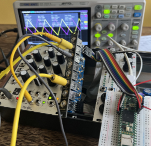

Teensy 4.x I2S TDM Audio Library 24/32 bit for AK4619 codec
===========================================================

This a partial port of Paul Stoffregen's [Teensy Audio Library](https://github.com/PaulStoffregen/Audio) which is converted to 32-bit audio instead of 16-bit.

The [AK4619VN Codec library](https://github.com/Lytrix/ak4619vn) is forked from the code created by Trimmenz for ESP32 boards and modified to work with a Teensy.

A bare bones working version (basic processing, passthrough and wav recording) not using the Audio library can be found in this branch:
https://github.com/Lytrix/Teensy4-i2s-TDM

The WavWrite.h code is forked from the Electro-Smith libDaisy example code [WavWrite.h](https://github.com/electro-smith/libDaisy/blob/f7727edb9a1febdd174b5310a7bc65340dae8700/src/util/WavWriter.h).

## Goal

My use case for extending this Teensy i2s library with 4 channel in/out AK4619 support is to build a 4 channel in/out eurorack audio looper using the awesome [Apfelaudio eurorack pmod module](https://apfelaudio.com/modules/)

## Installation

Download this repo as a zip and add the zip file as a zip library in Arduino IDE via the menu.

## Examples

- Passthrough       : 4 in goes to 4 out via buffer
- Recorder          : Record a 32-bit RAW file to SD card

## Pinout

Required pinout is the same as the Teensy Audio Board and the Teensy Audio library.

    MCLK	23      Audio Master Clock - Speed: 256 * Fs for 96kHz or 128 * Fs for 192khz
    BCLK	21      Audio Bit Clock (aka. Serial Clock / SCLK) - Speed: 64 * Fs (48khz) or 128 * Fs for 192khz
    LRCLK	20      Audio Left/Right Clock (aka. Word Clock / WCLK) - Speed: Fs (48, 96, 192kHz)
    DIN     7       Audio Data from Teensy > Codec
    DOUT	8       Audio Data from Codec > Teensy
    SCL	    19      I2C Control Clock
    SDA	    18      I2C Control Data

## Frequencies
The frequencies can be changed in the SAI setup in output_i2s.cpp.
Each clock pin can be verified via the serial output by wiring pin 9 to pin 19,20,21 or 23 on a Teensy 4.x.

At 44.1Khz:

    MCLK    11.289,600 Mhz
    BCLK    2.822,400 Mhz
    LRCLK   44.1 Khz

At 48Khz:

    MCLK    12.288 Mhz
    BCLK    3.072 Mhz
    LRCLK   48.0 Khz

At 96Khz 256fs:

    MCLK    25.496 Mhz
    BCLK    12.288 Mhz
    LRCLK   96.0 Khz

At 192khz 128fs:

    MCLK    25.496 Mhz
    BCLK    25.496 Mhz
    LRCLK   192.0 Khz

## Notes

Please note that the library always transmits and receives 32 bits between the codec and Teensy. Please ensure you shift your input and output values appropriately in code to work at your desired bit depth if needed.
For example, for 24 bit data, you must multiply output data by 256, or left-shift by 8 bits. Similarly, for input data, you must right shift by 8 bits or divide by 256 to obtain a 24 bit value.
